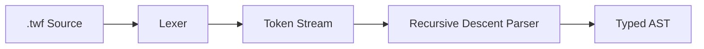

# Temporal DSL Go Parser

## Project Location

`temporal-workflow-design/parser/` as a standalone Go module. Canonical file extension: `.twf`.

## Architecture

Three-layer pipeline: **Lexer** (chars to tokens) -> **Parser** (tokens to AST) -> validated AST.




## Project Structure

```
temporal-workflow-design/parser/
  go.mod
  token/
    token.go              # Token types, Token struct, keyword table
  lexer/
    lexer.go              # Scanner with indentation tracking
    lexer_test.go
  ast/
    ast.go                # AST node interfaces and types
  parser/
    parser.go             # Recursive descent parser
    parser_test.go
```

## Design Principles (All Simplifications Applied)

1. **Loop unification** -- Go-style `for`: `for:` (infinite), `for condition:` (conditional), `for var in collection:` (iteration).
2. **Def vs call distinction** -- `workflow` and `activity` have both top-level defs (with bodies) and in-body calls. `signal`, `query`, `update` are top-level declarations attached to workflows via reference blocks.
3. **Workflow call modifiers** -- `child`, `detach`, and bare `workflow` express lifecycle relationship. `nexus <namespace>` is an optional prefix for cross-namespace calls. Sync/async determined by surrounding context (bare = wait, inside select/parallel = concurrent).
4. **Attachment blocks** -- Workflow defs have optional `signals:`, `queries:`, `updates:` blocks referencing declarations defined elsewhere in the file.
5. **No try/catch/raise** -- Error handling removed from grammar entirely.
6. **No config blocks** -- Call options (timeouts, retry policies) deferred.
7. **No infrastructure** -- `schedule`, `nexus_service`, `nexus_endpoint` out of scope.
8. **select/switch split** -- `select` races async primitives. `switch`/`case` is value dispatch (allowed in both workflow and activity bodies).
9. **Activity body restrictions** -- Activity bodies allow only imperative logic: `if`/`else`, `for`, `switch`/`case`, `break`, `continue`, `return`, raw statements, comments. No Temporal primitives.

## Syntax Changes from Current DSL

- **Assignment flip**: `result = activity GetOrder(orderId)` -> `activity GetOrder(orderId) -> result`
- **Workflow calls replace child/nexus**: `child WorkflowName(args)` -> `child workflow WorkflowName(args)`; `nexus ns/Op(args)` -> `nexus ns workflow Op(args)`
- **Keyword-first lines**: Every line starts with a recognized keyword, `#` comment, or is a raw statement fallback.

---

## Formal Grammar (EBNF)

Conventions: `UPPERCASE` = token, `lowercase` = production, `[...]` = optional, `{...}` = zero or more, `ARGS` = single token capturing raw content between `(` and `)`.

### File Structure

```ebnf
file           = { top_level_item } EOF ;
top_level_item = definition | COMMENT | NEWLINE ;

definition     = workflow_def
               | activity_def
               | signal_decl
               | query_decl
               | update_decl ;
```

### Top-Level Definitions

```ebnf
workflow_def = WORKFLOW IDENT ARGS [ ARROW type_expr ] COLON NEWLINE
               INDENT [ signals_block ] [ queries_block ] [ updates_block ]
               workflow_body DEDENT ;

activity_def = ACTIVITY IDENT ARGS [ ARROW type_expr ] COLON NEWLINE
               INDENT activity_body DEDENT ;

signal_decl  = SIGNAL IDENT ARGS NEWLINE ;
query_decl   = QUERY IDENT ARGS [ ARROW type_expr ] NEWLINE ;
update_decl  = UPDATE IDENT ARGS [ ARROW type_expr ] NEWLINE ;
```

### Attachment Blocks (inside workflow def, before body)

```ebnf
signals_block = SIGNALS COLON NEWLINE INDENT { IDENT NEWLINE } DEDENT ;
queries_block = QUERIES COLON NEWLINE INDENT { IDENT NEWLINE } DEDENT ;
updates_block = UPDATES COLON NEWLINE INDENT { IDENT NEWLINE } DEDENT ;
```

Example:

```
workflow OrderWorkflow(orderId: string) -> OrderResult:
    signals:
        PaymentReceived
        OrderCancelled
    queries:
        GetStatus
    updates:
        ChangePlan

    activity GetOrder(orderId) -> order
    await signal PaymentReceived
    return OrderResult{status: "completed"}
```

### Workflow Body

```ebnf
workflow_body = { workflow_stmt | COMMENT | NEWLINE } ;

workflow_stmt = activity_call
              | workflow_call
              | timer_stmt
              | await_stmt
              | parallel_block
              | select_block
              | switch_block
              | if_stmt
              | for_stmt
              | return_stmt
              | continue_as_new_stmt
              | break_stmt
              | continue_stmt
              | raw_stmt ;
```

### Activity Body (restricted -- no Temporal primitives)

```ebnf
activity_body = { activity_stmt | COMMENT | NEWLINE } ;

activity_stmt = switch_block
              | if_stmt
              | for_stmt
              | return_stmt
              | break_stmt
              | continue_stmt
              | raw_stmt ;
```

### Call Statements

**Activity call** (inside workflow body):

```ebnf
activity_call = ACTIVITY IDENT ARGS [ ARROW IDENT ] NEWLINE ;
```

**Workflow call** (inside workflow body) -- three modifiers express lifecycle:

```ebnf
workflow_call = [ CHILD | DETACH ] [ NEXUS IDENT ] WORKFLOW IDENT ARGS [ ARROW IDENT ] NEWLINE ;
```

- `child workflow Name(args) [-> result]` -- parent-child, waits for completion
- `workflow Name(args) [-> result]` -- independent, waits for result
- `detach workflow Name(args)` -- fire-and-forget (no `-> result`)
- Any form can include `nexus <namespace>` for cross-namespace calls

Validation: `DETACH` + `ARROW` is an error (can't capture result from fire-and-forget).

Examples:

```
child workflow ShipOrder(order) -> shipResult
workflow ProcessPayment(order) -> paymentResult
detach workflow SendNotification(order.customer)
child nexus payments workflow ProcessPayment(order.payment) -> paymentResult
detach nexus notifications workflow SendEmail(email)
```

### Timer

```ebnf
timer_stmt = TIMER duration_expr NEWLINE ;
```

### Await

Restricted to `signal` and `update` targets. Multiple targets joined with `or`. For timeouts, use `select` to race against a `timer`.

```ebnf
await_stmt   = AWAIT await_target { OR await_target } NEWLINE ;
await_target = SIGNAL IDENT [ ARGS ] | UPDATE IDENT [ ARGS ] ;
```

### Parallel

```ebnf
parallel_block = PARALLEL COLON NEWLINE INDENT workflow_body DEDENT ;
```

### Select (Async Primitive Racing)

Races concurrent Temporal primitives. First case to complete wins. `DETACH` not allowed in cases (can't race fire-and-forget).

```ebnf
select_block = SELECT COLON NEWLINE INDENT { select_case } DEDENT ;

select_case  = ( [ CHILD ] [ NEXUS IDENT ] WORKFLOW IDENT ARGS [ ARROW IDENT ]
               | ACTIVITY IDENT ARGS [ ARROW IDENT ]
               | SIGNAL IDENT [ ARGS ]
               | UPDATE IDENT [ ARGS ]
               | TIMER duration_expr )
               COLON NEWLINE INDENT workflow_body DEDENT ;
```

Example:

```
select:
    child workflow ProcessPayment(order) -> paymentResult:
        activity HandlePayment(paymentResult)
    signal PaymentReceived:
        activity FulfillOrder(order)
    timer 24h:
        activity CancelOrder(orderId)
```

### Switch (Value Dispatch)

Dispatches on a value expression. Allowed in both workflow and activity bodies.

```ebnf
switch_block   = SWITCH raw_expr COLON NEWLINE
                 INDENT { switch_case } [ switch_default ] DEDENT ;
switch_case    = CASE raw_expr COLON NEWLINE INDENT body DEDENT ;
switch_default = ELSE COLON NEWLINE INDENT body DEDENT ;
```

Note: `body` inside switch cases inherits context (workflow_body or activity_body) from the enclosing definition.

### Control Flow

```ebnf
if_stmt   = IF condition COLON NEWLINE INDENT body DEDENT
            [ ELSE COLON NEWLINE INDENT body DEDENT ] ;

for_stmt  = FOR for_clause COLON NEWLINE INDENT body DEDENT ;

for_clause = (* three forms, distinguished by parser lookahead *)
             (* form 1: infinite loop *)  (* nothing -- just COLON *)
           | (* form 2: conditional    *)  condition
           | (* form 3: iteration      *)  IDENT IN iterable_expr ;
```

The parser distinguishes `for` forms by lookahead after consuming `FOR`:

- Next is `COLON` -> infinite loop (`for:`)
- Next is `IDENT` followed by `IN` -> iteration (`for item in collection:`)
- Otherwise -> conditional loop (`for count < limit:`)

### Simple Statements

```ebnf
return_stmt          = RETURN [ raw_expr ] NEWLINE ;
continue_as_new_stmt = CONTINUE_AS_NEW ARGS NEWLINE ;
break_stmt           = BREAK NEWLINE ;
continue_stmt        = CONTINUE NEWLINE ;
```

### Fallback

```ebnf
raw_stmt = raw_line NEWLINE ;
```

Any line whose first token is not a recognized keyword (and is not a comment) is captured whole as a `RawStmt`. Handles inline assignments, state mutations, and other imperative code.

### Opaque Expressions

Captured as raw strings by `collectRawUntil`. Not sub-parsed.

```ebnf
type_expr     = <tokens until COLON or NEWLINE> ;
condition     = <tokens until COLON> ;
iterable_expr = <tokens until COLON> ;
duration_expr = <tokens until NEWLINE or COLON> ;
raw_expr      = <tokens until NEWLINE> ;
raw_line      = <all tokens on the line until NEWLINE> ;
```

---

## Token Design (`token/token.go`)

```go
type TokenType int

const (
    // Structural
    EOF TokenType = iota
    NEWLINE
    INDENT
    DEDENT

    // Keywords -- top-level defs
    WORKFLOW
    ACTIVITY
    SIGNAL
    QUERY
    UPDATE

    // Keywords -- attachment blocks
    SIGNALS
    QUERIES
    UPDATES

    // Keywords -- workflow call modifiers
    CHILD
    DETACH
    NEXUS

    // Keywords -- other calls
    TIMER

    // Keywords -- async
    AWAIT
    OR

    // Keywords -- blocks
    PARALLEL
    SELECT
    SWITCH
    CASE

    // Keywords -- control flow
    IF
    ELSE
    FOR
    IN

    // Keywords -- simple statements
    RETURN
    CONTINUE_AS_NEW
    BREAK
    CONTINUE

    // Symbols
    COLON  // :
    ARROW  // ->

    // Values
    IDENT    // non-keyword identifiers
    ARGS     // raw content between ( and )
    COMMENT  // text after #
    RAW_TEXT // anything else
)
```

26 keywords + 2 symbols + 4 structural + 4 value types = **36 token types**.

Changes from previous revision: removed `TRY`, `CATCH`, `AS`, `RAISE`, `SLASH`. Added `DETACH`, `SIGNALS`, `QUERIES`, `UPDATES`.

---

## AST Design (`ast/ast.go`)

Two interfaces -- `Definition` (top-level) and `Statement` (inside bodies) -- with a `Node` base providing position info.

**Top-level definitions:**

- `WorkflowDef` -- Name, Params (opaque), ReturnType (opaque, optional), SignalRefs ([]string), QueryRefs ([]string), UpdateRefs ([]string), Body ([]Statement)
- `ActivityDef` -- Name, Params (opaque), ReturnType (opaque, optional), Body ([]Statement)
- `SignalDecl` -- Name, Params (opaque)
- `QueryDecl` -- Name, Params (opaque), ReturnType (opaque, optional)
- `UpdateDecl` -- Name, Params (opaque), ReturnType (opaque, optional)

**Statements:**

- `ActivityCall` -- Name, Args (opaque), Result (optional)
- `WorkflowCall` -- Mode (Child/Detach/Bare), Namespace (optional), Name, Args (opaque), Result (optional)
- `TimerStmt` -- Duration (opaque)
- `AwaitStmt` -- Targets ([]AwaitTarget)
- `ParallelBlock` -- Body
- `SelectBlock` -- Cases ([]SelectCase)
- `SwitchBlock` -- Expr (opaque), Cases ([]SwitchCase), Default body (optional)
- `IfStmt` -- Condition (opaque), Body, ElseBody (optional)
- `ForStmt` -- Variant (Infinite/Conditional/Iteration), Body
- `ReturnStmt` -- Value (opaque, optional)
- `ContinueAsNewStmt` -- Args (opaque)
- `BreakStmt` -- (position only)
- `ContinueStmt` -- (position only)
- `RawStmt` -- Text (entire line)
- `Comment` -- Text

**Supporting types:**

- `AwaitTarget` -- Kind ("signal"/"update"), Name, Args (opaque, optional)
- `SelectCase` -- Primitive kind + fields (varies), Body
- `SwitchCase` -- Value (opaque), Body
- `ForVariant` -- Infinite | Conditional{Condition} | Iteration{Variable, Iterable}
- `WorkflowCallMode` -- Child | Detach | Bare

All opaque fields stored as `string`.

---

## Parser Design (`parser/parser.go`)

Recursive descent parser with context tracking (`inActivityDef` flag for body restrictions).

**Top-level dispatch** (`ParseFile`):

- `WORKFLOW` -> `parseWorkflowDef()`
- `ACTIVITY` -> `parseActivityDef()`
- `SIGNAL` -> `parseSignalDecl()`
- `QUERY` -> `parseQueryDecl()`
- `UPDATE` -> `parseUpdateDecl()`
- `COMMENT` -> comment node
- Other keywords at top level -> error

**Workflow body statement dispatch** (`parseWorkflowStmt`):

- `ACTIVITY` -> `parseActivityCall()`
- `CHILD` / `DETACH` / `NEXUS` / `WORKFLOW` -> `parseWorkflowCall()`
- `TIMER` -> `parseTimerStmt()`
- `AWAIT` -> `parseAwaitStmt()`
- `PARALLEL` -> `parseParallelBlock()`
- `SELECT` -> `parseSelectBlock()`
- `SWITCH` -> `parseSwitchBlock()`
- `IF` -> `parseIfStmt()`
- `FOR` -> `parseForStmt()`
- `RETURN` -> `parseReturnStmt()`
- `CONTINUE_AS_NEW` -> `parseContinueAsNewStmt()`
- `BREAK` -> `parseBreakStmt()`
- `CONTINUE` -> `parseContinueStmt()`
- `COMMENT` -> comment
- Otherwise -> `parseRawStmt()`

**Activity body statement dispatch** (`parseActivityStmt`):

- `IF` -> `parseIfStmt()`
- `FOR` -> `parseForStmt()`
- `SWITCH` -> `parseSwitchBlock()`
- `RETURN` -> `parseReturnStmt()`
- `BREAK` -> `parseBreakStmt()`
- `CONTINUE` -> `parseContinueStmt()`
- `COMMENT` -> comment
- Temporal primitive keyword -> error ("not allowed in activity body")
- Otherwise -> `parseRawStmt()`

**Key helper**: `collectRawUntil(terminators ...TokenType) string` -- reads and concatenates tokens until a terminator is found.

**Workflow def parsing**: After consuming signature, enter body. Check for optional `SIGNALS`/`QUERIES`/`UPDATES` blocks (must come before statements). Then parse workflow body.

**Workflow call parsing**: Consume optional `CHILD`/`DETACH`, optional `NEXUS IDENT`, then expect `WORKFLOW IDENT ARGS [ARROW IDENT] NEWLINE`. Validate: detach + arrow = error.

---

## Validation Rules

- `await` must be followed by `signal` or `update` -- enforced in `parseAwaitStmt`
- `detach` + `-> result` is an error -- enforced in `parseWorkflowCall`
- `select` cases cannot use `detach` -- enforced in `parseSelectBlock`
- Workflow/activity/signal/query/update defs only at top level -- enforced by top-level vs body dispatch
- Temporal primitives not allowed in activity bodies -- enforced by `parseActivityStmt`
- `switch` must have at least one `case` -- enforced in `parseSwitchBlock`
- `case` only inside `switch` -- enforced by statement dispatch
- `else` only after `if` body or as last item in `switch` -- enforced by lookahead
- `break`/`continue` only inside `for` -- enforced by context flag or deferred validation
- `continue_as_new` only inside workflow body -- enforced by context
- Attachment blocks (`signals:`, `queries:`, `updates:`) must precede body statements -- enforced by parsing order
- Indentation must be consistent -- enforced by lexer indent stack

---

## Error Handling

```go
type ParseError struct {
    Msg    string
    Line   int
    Column int
}
```

Fail on first error for v1. Recovery can be layered on later.

---

## Test Strategy

- **Lexer tests**: Token streams for indentation, keywords, args, comments, arrows, `continue_as_new`, blank lines, mixed indent errors, new keywords (`detach`, `signals`, `queries`, `updates`).
- **Parser tests**: Full DSL snippets asserting AST structure:
  - Workflow def with attachment blocks and body
  - Activity def with imperative body (if/for/switch/raw)
  - Signal/query/update bare declarations
  - Workflow calls: child, detach, bare, with nexus prefix
  - All three `for` forms
  - Parallel and select blocks (including workflow call cases in select)
  - Switch/case with else default
  - Await (simple and multi-target with `or`)
  - Comments and raw statements
  - Error cases: detach with arrow, Temporal primitive in activity body, bad indentation, missing keywords, invalid await targets, bare `case` outside `switch`

