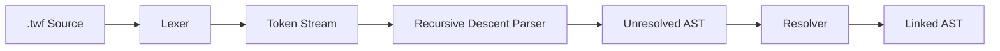

# Temporal DSL Go Parser

## Project Location

`temporal-workflow-design/parser/` as a standalone Go module. Canonical file extension: `.twf`.

## Architecture

Four-layer pipeline: **Lexer** (chars to tokens) -> **Parser** (tokens to AST) -> **Resolver** (links calls to definitions) -> validated, linked AST.



## Project Structure

Minimal layout (one file per package):

```
parser/
  go.mod
  token/
    token.go
  ast/
    ast.go
  lexer/
    lexer.go
    lexer_test.go
  parser/
    parser.go
    parser_test.go
  resolver/
    resolver.go
    resolver_test.go
```

**NOTE — Split into smaller files as needed.** If any file grows beyond ~300 lines, break it up. Likely splits:

```
parser/
  token/
    types.go              # TokenType constants
    token.go              # Token struct, String()
    keywords.go           # Keyword lookup table
  ast/
    node.go               # Base interfaces (Node, Definition, Statement)
    definitions.go        # WorkflowDef, ActivityDef
    statements.go         # All statement types
    types.go              # Supporting types (AwaitTarget, SelectCase, etc.)
  lexer/
    lexer.go              # Core scanner loop
    indent.go             # Indent stack and INDENT/DEDENT logic
    lexer_test.go
  parser/
    parser.go             # Core parser struct, top-level dispatch
    definitions.go        # parseWorkflowDef, parseActivityDef
    statements.go         # Statement parsers (calls, control flow, etc.)
    helpers.go            # collectRawUntil, expectToken, etc.
    parser_test.go
  resolver/
    resolver.go           # Walk + link
    resolver_test.go
```

Prefer smaller files. They are easier to work with and reason about.

## Design Principles

1. **Parens everywhere** -- Inputs, outputs, conditions, and expressions are all paren-delimited. `workflow Foo(input: In) -> (Out):`, `if (cond):`, `for (x in items):`, `switch (val):`. Bare `return expr` is the exception (no parens).
2. **No nested parens** -- Inside any paren-delimited block (`ARGS` token), nested `(` and `)` are **disallowed**. The first `)` always closes the block. This keeps the lexer trivial and parsing unambiguous.
3. **Child is implicit** -- Bare `workflow Name(args)` is a child workflow call (most common case). `spawn` for independent execution. `detach` for fire-and-forget.
4. **Nexus namespaces in quotes** -- `nexus "payments" workflow Name(args)`. Quotes make namespace boundaries unambiguous.
5. **Declarations at workflow level** -- `signal`, `query`, `update` are defined inside the workflow that handles them. No top-level declarations, no attachment blocks.
6. **Options statement** -- `options(...)` can appear on the next line (indented) after any activity/workflow call or definition signature. Parser does not validate option contents.
7. **Def vs call distinction** -- `workflow` and `activity` have both top-level defs (with `:` and bodies) and in-body calls (no `:`). Defs end with `COLON`, calls do not.
8. **Loop unification** -- Go-style `for`: `for:` (infinite), `for (condition):` (conditional), `for (var in collection):` (iteration).
9. **select/switch split** -- `select` races async primitives. `switch`/`case` is value dispatch (allowed in both workflow and activity bodies).
10. **Activity body restrictions** -- Activity bodies allow only imperative logic: `if`/`else`, `for`, `switch`/`case`, `break`, `continue`, `return`, raw statements, comments. No Temporal primitives.
11. **No try/catch/raise** -- Error handling removed from grammar entirely.
12. **No infrastructure** -- `schedule`, `nexus_service`, `nexus_endpoint` out of scope.
13. **Simple, extensible parser patterns** -- Registration-based keyword dispatch (map of keyword -> parse function) rather than monolithic switch statements. Adding a new keyword means adding one entry to the registry. Visitor/walker pattern for AST traversal.

## Syntax Summary

```
# Top-level definitions
workflow OrderFulfillment(orderId: string) -> (OrderResult):
    ...body...

activity GetOrder(orderId: string) -> (Order):
    ...body...

# Signal/query/update defined inside workflows
workflow OrderWorkflow(orderId: string) -> (OrderResult):
    signal PaymentReceived(transactionId: string, amount: decimal)
    query GetStatus() -> (OrderStatus)
    update ChangeAddress(addr: Address) -> (UpdateResult)

    activity GetOrder(orderId) -> order
    await signal PaymentReceived
    return OrderResult{status: "completed"}

# Workflow calls
workflow ShipOrder(order) -> shipResult                          # child (implicit)
spawn workflow ProcessAsync(data) -> result                      # independent, wait for result
detach workflow SendNotification(customer)                       # fire-and-forget
nexus "payments" workflow Charge(card) -> chargeResult           # child, cross-namespace
spawn nexus "shipping" workflow Ship(order) -> shipment          # independent, cross-namespace
detach nexus "notifications" workflow SendEmail(email)           # fire-and-forget, cross-namespace

# Options (next line, indented)
activity CreateShipment(order) -> shipment
    options(startToCloseTimeout: 30s, retryPolicy: {maxAttempts: 3})

# Control flow uses parens
if (validated.priority == "high"):
    ...
for (item in order.items):
    ...
for (retries < 3):
    ...
switch (batch.type):
    case "invoice":
        ...
```

---

## Formal Grammar (EBNF)

Conventions: `UPPERCASE` = token, `lowercase` = production, `[...]` = optional, `{...}` = zero or more, `ARGS` = single token capturing raw content between `(` and `)` with no nested parens.

### File Structure

```ebnf
file           = { top_level_item } EOF ;
top_level_item = definition | COMMENT | NEWLINE ;

definition     = workflow_def
               | activity_def ;
```

### Top-Level Definitions

```ebnf
workflow_def = WORKFLOW IDENT ARGS [ ARROW ARGS ] COLON NEWLINE
               INDENT [ options_stmt ]
               { signal_def | query_def | update_def }
               workflow_body DEDENT ;

activity_def = ACTIVITY IDENT ARGS [ ARROW ARGS ] COLON NEWLINE
               INDENT [ options_stmt ] activity_body DEDENT ;
```

Return types use `ARGS` (paren-delimited): `-> (OrderResult)`.

### Workflow-Level Declarations

Signal, query, and update are defined inside the workflow, before body statements.

```ebnf
signal_def = SIGNAL IDENT ARGS NEWLINE ;
query_def  = QUERY IDENT ARGS [ ARROW ARGS ] NEWLINE ;
update_def = UPDATE IDENT ARGS [ ARROW ARGS ] NEWLINE ;
```

Example:

```
workflow OrderWorkflow(orderId: string) -> (OrderResult):
    signal PaymentReceived(transactionId: string, amount: decimal)
    signal OrderCancelled(reason: string)
    query GetStatus() -> (OrderStatus)
    update ChangeAddress(addr: Address) -> (UpdateResult)

    activity GetOrder(orderId) -> order
    await signal PaymentReceived
    return OrderResult{status: "completed"}
```

### Workflow Body

```ebnf
workflow_body = { workflow_stmt | COMMENT | NEWLINE } ;

workflow_stmt = activity_call
              | workflow_call
              | timer_stmt
              | await_stmt
              | parallel_block
              | select_block
              | switch_block
              | if_stmt
              | for_stmt
              | return_stmt
              | continue_as_new_stmt
              | break_stmt
              | continue_stmt
              | raw_stmt ;
```

### Activity Body (restricted -- no Temporal primitives)

```ebnf
activity_body = { activity_stmt | COMMENT | NEWLINE } ;

activity_stmt = switch_block
              | if_stmt
              | for_stmt
              | return_stmt
              | break_stmt
              | continue_stmt
              | raw_stmt ;
```

### Call Statements

**Activity call** (inside workflow body):

```ebnf
activity_call = ACTIVITY IDENT ARGS [ ARROW IDENT ] NEWLINE [ options_line ] ;
```

**Workflow call** (inside workflow body) -- three lifecycle modifiers:

```ebnf
workflow_call = [ SPAWN | DETACH ] [ NEXUS STRING ] WORKFLOW IDENT ARGS [ ARROW IDENT ] NEWLINE [ options_line ] ;
```

- `workflow Name(args) [-> result]` -- child (implicit), waits for completion
- `spawn workflow Name(args) [-> result]` -- independent, waits for result
- `detach workflow Name(args)` -- fire-and-forget (no `-> result`)
- Any form can include `nexus "namespace"` for cross-namespace calls

Validation: `DETACH` + `ARROW` is an error (can't capture result from fire-and-forget).

Examples:

```
workflow ShipOrder(order) -> shipResult
spawn workflow ProcessPayment(order) -> paymentResult
detach workflow SendNotification(order.customer)
nexus "payments" workflow ProcessPayment(order.payment) -> paymentResult
spawn nexus "shipping" workflow CreateShipment(order) -> shipment
detach nexus "notifications" workflow SendEmail(email)
```

### Options

Options can appear on the next line (indented) after a call or as the first statement in a definition body. Content inside parens is opaque -- the parser does not validate it.

```ebnf
options_line = INDENT OPTIONS ARGS NEWLINE DEDENT ;
options_stmt = OPTIONS ARGS NEWLINE ;
```

`options_line` is for calls (creates indent/dedent around a single line). `options_stmt` is for definitions (already inside a body at the correct indent level).

Examples:

```
# After a call (indented under it)
activity CreateShipment(order) -> shipment
    options(startToCloseTimeout: 30s, retryPolicy: {maxAttempts: 3})

workflow ShipOrder(order) -> result
    options(workflowExecutionTimeout: 24h)

# At the start of a definition body
activity GetOrder(orderId: string) -> (Order):
    options(startToCloseTimeout: 10s)
    order = db.get(orderId)
    return order
```

### Timer

```ebnf
timer_stmt = TIMER duration_expr NEWLINE ;
```

### Await

Restricted to `signal` and `update` targets. Multiple targets joined with `or`. For timeouts, use `select` to race against a `timer`.

```ebnf
await_stmt   = AWAIT await_target { OR await_target } NEWLINE ;
await_target = SIGNAL IDENT [ ARGS ] | UPDATE IDENT [ ARGS ] ;
```

### Parallel

```ebnf
parallel_block = PARALLEL COLON NEWLINE INDENT workflow_body DEDENT ;
```

### Select (Async Primitive Racing)

Races concurrent Temporal primitives. First case to complete wins. `DETACH` not allowed in cases (can't race fire-and-forget).

```ebnf
select_block = SELECT COLON NEWLINE INDENT { select_case } DEDENT ;

select_case  = ( [ SPAWN ] [ NEXUS STRING ] WORKFLOW IDENT ARGS [ ARROW IDENT ]
               | ACTIVITY IDENT ARGS [ ARROW IDENT ]
               | SIGNAL IDENT [ ARGS ]
               | UPDATE IDENT [ ARGS ]
               | TIMER duration_expr )
               COLON NEWLINE INDENT workflow_body DEDENT ;
```

Example:

```
select:
    workflow ProcessPayment(order) -> paymentResult:
        activity HandlePayment(paymentResult)
    signal PaymentReceived:
        activity FulfillOrder(order)
    timer 24h:
        activity CancelOrder(orderId)
```

### Switch (Value Dispatch)

Dispatches on a value expression. Allowed in both workflow and activity bodies. Expression is paren-delimited.

```ebnf
switch_block   = SWITCH ARGS COLON NEWLINE
                 INDENT { switch_case } [ switch_default ] DEDENT ;
switch_case    = CASE raw_expr COLON NEWLINE INDENT body DEDENT ;
switch_default = ELSE COLON NEWLINE INDENT body DEDENT ;
```

Note: `body` inside switch cases inherits context (workflow_body or activity_body) from the enclosing definition.

### Control Flow

Conditions and clauses are paren-delimited.

```ebnf
if_stmt   = IF ARGS COLON NEWLINE INDENT body DEDENT
            [ ELSE COLON NEWLINE INDENT body DEDENT ] ;

for_stmt  = FOR [ ARGS ] COLON NEWLINE INDENT body DEDENT ;
```

The parser distinguishes `for` forms by examining the content of ARGS (or its absence):

- No ARGS (next token is `COLON`) -> infinite loop (`for:`)
- ARGS contains `IN` keyword -> iteration (`for (item in collection):`)
- Otherwise -> conditional loop (`for (count < limit):`)

### Simple Statements

```ebnf
return_stmt          = RETURN [ raw_expr ] NEWLINE ;
continue_as_new_stmt = CONTINUE_AS_NEW ARGS NEWLINE ;
break_stmt           = BREAK NEWLINE ;
continue_stmt        = CONTINUE NEWLINE ;
```

### Fallback

```ebnf
raw_stmt = raw_line NEWLINE ;
```

Any line whose first token is not a recognized keyword (and is not a comment) is captured whole as a `RawStmt`. Handles inline assignments, state mutations, and other imperative code.

### Opaque Expressions

Captured as raw strings by `collectRawUntil`. Not sub-parsed.

```ebnf
duration_expr = <tokens until NEWLINE or COLON> ;
raw_expr      = <tokens until NEWLINE> ;
raw_line      = <all tokens on the line until NEWLINE> ;
```

Note: `type_expr`, `condition`, and `iterable_expr` from the previous revision are now captured inside `ARGS` tokens (paren-delimited) and do not need separate productions.

---

## Token Design

```go
type TokenType int

const (
    // Structural
    EOF TokenType = iota
    NEWLINE
    INDENT
    DEDENT

    // Keywords -- top-level defs
    WORKFLOW
    ACTIVITY

    // Keywords -- workflow-level declarations
    SIGNAL
    QUERY
    UPDATE

    // Keywords -- workflow call modifiers
    SPAWN
    DETACH
    NEXUS

    // Keywords -- calls and primitives
    TIMER
    OPTIONS

    // Keywords -- async
    AWAIT
    OR

    // Keywords -- blocks
    PARALLEL
    SELECT
    SWITCH
    CASE

    // Keywords -- control flow
    IF
    ELSE
    FOR
    IN

    // Keywords -- simple statements
    RETURN
    CONTINUE_AS_NEW
    BREAK
    CONTINUE

    // Symbols
    COLON  // :
    ARROW  // ->

    // Values
    IDENT    // non-keyword identifiers
    STRING   // quoted string (for nexus namespaces)
    ARGS     // raw content between ( and ), no nested parens
    COMMENT  // text after #
    RAW_TEXT // anything else
)
```

24 keywords + 2 symbols + 4 structural + 5 value types = **35 token types**.

Changes from previous revision: removed `CHILD`, `SIGNALS`, `QUERIES`, `UPDATES`. Added `SPAWN`, `OPTIONS`, `STRING`.

---

## AST Design

Two interfaces -- `Definition` (top-level) and `Statement` (inside bodies) -- with a `Node` base providing position info.

**Top-level definitions (2):**

- `WorkflowDef` -- Name, Params (opaque), ReturnType (opaque, optional), Options (opaque, optional), Signals ([]SignalDecl), Queries ([]QueryDecl), Updates ([]UpdateDecl), Body ([]Statement)
- `ActivityDef` -- Name, Params (opaque), ReturnType (opaque, optional), Options (opaque, optional), Body ([]Statement)

**Workflow-level declarations (embedded in WorkflowDef, not standalone):**

- `SignalDecl` -- Name, Params (opaque)
- `QueryDecl` -- Name, Params (opaque), ReturnType (opaque, optional)
- `UpdateDecl` -- Name, Params (opaque), ReturnType (opaque, optional)

**Statements (18):**

- `ActivityCall` -- Name, Args (opaque), Result (optional), Options (opaque, optional)
- `WorkflowCall` -- Mode (Child/Spawn/Detach), Namespace (optional, quoted string), Name, Args (opaque), Result (optional), Options (opaque, optional)
- `TimerStmt` -- Duration (opaque)
- `AwaitStmt` -- Targets ([]AwaitTarget)
- `ParallelBlock` -- Body
- `SelectBlock` -- Cases ([]SelectCase)
- `SwitchBlock` -- Expr (opaque), Cases ([]SwitchCase), Default body (optional)
- `IfStmt` -- Condition (opaque), Body, ElseBody (optional)
- `ForStmt` -- Variant (Infinite/Conditional/Iteration), Body
- `ReturnStmt` -- Value (opaque, optional)
- `ContinueAsNewStmt` -- Args (opaque)
- `BreakStmt` -- (position only)
- `ContinueStmt` -- (position only)
- `RawStmt` -- Text (entire line)
- `Comment` -- Text
- `SignalDecl` -- (also a statement when inside workflow body)
- `QueryDecl` -- (also a statement when inside workflow body)
- `UpdateDecl` -- (also a statement when inside workflow body)

**Supporting types:**

- `AwaitTarget` -- Kind ("signal"/"update"), Name, Args (opaque, optional)
- `SelectCase` -- Primitive kind + fields (varies), Body
- `SwitchCase` -- Value (opaque), Body
- `ForVariant` -- Infinite | Conditional{Condition} | Iteration{Variable, Iterable}
- `WorkflowCallMode` -- Child | Spawn | Detach

All opaque fields stored as `string`.

---

## Resolver Design

After parsing, a resolution pass walks the AST to link calls to their definitions. This is a separate package (`resolver/`) that operates on the parsed AST.

**What it links:**

- `ActivityCall.Name` -> matching `ActivityDef` (top-level)
- `WorkflowCall.Name` -> matching `WorkflowDef` (top-level)
- `AwaitStmt` signal targets -> matching `SignalDecl` (in enclosing workflow)
- `AwaitStmt` update targets -> matching `UpdateDecl` (in enclosing workflow)
- `SelectCase` signal/update cases -> matching decls (in enclosing workflow)

**Errors reported:**

- Undefined activity (call references non-existent activity def)
- Undefined workflow (call references non-existent workflow def)
- Undefined signal/update (await references signal/update not declared in this workflow)
- Duplicate definition names (two workflows with same name, etc.)

**Implementation:** Single-pass walk. First pass collects all top-level definitions into a lookup map. Second pass walks all workflow bodies resolving references. Linked references can be stored as pointer fields on the AST nodes (e.g., `ActivityCall.Resolved *ActivityDef`).

---

## Parser Design

Recursive descent parser with **registration-based dispatch** for extensibility.

### Keyword Dispatch Pattern

Rather than monolithic switch statements, use a map of keyword -> parse function:

```go
type stmtParser func(p *Parser) (ast.Statement, error)

// Registered at init
topLevelParsers    map[token.TokenType]func(p *Parser) (ast.Definition, error)
workflowStmtParsers map[token.TokenType]stmtParser
activityStmtParsers map[token.TokenType]stmtParser
```

Adding a new keyword means adding one entry to the appropriate registry. The dispatch loop is just a map lookup + fallback to `parseRawStmt()`.

### Top-Level Dispatch

- `WORKFLOW` -> `parseWorkflowDef()`
- `ACTIVITY` -> `parseActivityDef()`
- `COMMENT` -> comment node
- Other keywords at top level -> error

### Workflow Body Dispatch

- `SIGNAL` -> `parseSignalDecl()` (only before first non-decl statement)
- `QUERY` -> `parseQueryDecl()` (only before first non-decl statement)
- `UPDATE` -> `parseUpdateDecl()` (only before first non-decl statement)
- `ACTIVITY` -> `parseActivityCall()`
- `SPAWN` / `DETACH` / `NEXUS` / `WORKFLOW` -> `parseWorkflowCall()`
- `TIMER` -> `parseTimerStmt()`
- `AWAIT` -> `parseAwaitStmt()`
- `PARALLEL` -> `parseParallelBlock()`
- `SELECT` -> `parseSelectBlock()`
- `SWITCH` -> `parseSwitchBlock()`
- `IF` -> `parseIfStmt()`
- `FOR` -> `parseForStmt()`
- `RETURN` -> `parseReturnStmt()`
- `CONTINUE_AS_NEW` -> `parseContinueAsNewStmt()`
- `BREAK` -> `parseBreakStmt()`
- `CONTINUE` -> `parseContinueStmt()`
- `COMMENT` -> comment
- Otherwise -> `parseRawStmt()`

### Activity Body Dispatch

- `IF` -> `parseIfStmt()`
- `FOR` -> `parseForStmt()`
- `SWITCH` -> `parseSwitchBlock()`
- `RETURN` -> `parseReturnStmt()`
- `BREAK` -> `parseBreakStmt()`
- `CONTINUE` -> `parseContinueStmt()`
- `COMMENT` -> comment
- Temporal primitive keyword -> error ("not allowed in activity body")
- Otherwise -> `parseRawStmt()`

### Key Helpers

- `collectRawUntil(terminators ...TokenType) string` -- reads and concatenates tokens until a terminator is found
- `expectToken(tt TokenType) (Token, error)` -- consume and validate next token
- `peekToken() Token` -- lookahead without consuming
- `parseOptionalOptions() (string, error)` -- after a call or at body start, check for INDENT OPTIONS ARGS DEDENT

### Workflow Call Parsing

Consume optional `SPAWN`/`DETACH`, optional `NEXUS STRING`, then expect `WORKFLOW IDENT ARGS [ARROW IDENT] NEWLINE`. Check for trailing options line. Validate: detach + arrow = error.

### For Statement Parsing

After consuming `FOR`, check next token:
- `COLON` -> infinite loop (`for:`)
- `ARGS` -> examine content for `IN` keyword to distinguish conditional vs iteration

---

## Validation Rules

- `await` must be followed by `signal` or `update` -- enforced in `parseAwaitStmt`
- `detach` + `-> result` is an error -- enforced in `parseWorkflowCall`
- `select` cases cannot use `detach` -- enforced in `parseSelectBlock`
- Workflow/activity defs only at top level -- enforced by top-level dispatch
- Signal/query/update defs only inside workflow body (before other statements) -- enforced by workflow body parser
- Temporal primitives not allowed in activity bodies -- enforced by `activityStmtParsers` registry
- `switch` must have at least one `case` -- enforced in `parseSwitchBlock`
- `case` only inside `switch` -- enforced by statement dispatch
- `else` only after `if` body or as last item in `switch` -- enforced by lookahead
- `break`/`continue` only inside `for` -- enforced by context flag or deferred validation
- `continue_as_new` only inside workflow body -- enforced by context
- No nested parens in `ARGS` tokens -- enforced by lexer (first `)` closes)
- Indentation must be consistent -- enforced by lexer indent stack
- Options must immediately follow a call/def (no intervening statements) -- enforced by parser lookahead

---

## Error Handling

```go
type ParseError struct {
    Msg    string
    Line   int
    Column int
}
```

Fail on first error for v1. Recovery can be layered on later.

---

## Test Strategy

- **Lexer tests**: Token streams for indentation, keywords, args (including paren rejection for nested parens), quoted strings, comments, arrows, `continue_as_new`, blank lines, mixed indent errors, `spawn`, `options`.
- **Parser tests**: Full DSL snippets asserting AST structure:
  - Workflow def with signal/query/update declarations and body
  - Activity def with imperative body (if/for/switch/raw)
  - Activity def with options
  - Workflow calls: child (bare), spawn, detach, with nexus prefix
  - Workflow/activity calls with options lines
  - All three `for` forms with paren-delimited clauses
  - `if` and `switch` with paren-delimited expressions
  - Parallel and select blocks
  - Switch/case with else default
  - Await (simple and multi-target with `or`)
  - Comments and raw statements
  - `continue_as_new`
  - Error cases: detach with arrow, Temporal primitive in activity body, bad indentation, missing keywords, invalid await targets, bare `case` outside `switch`, nested parens in args, signal/query/update outside workflow
- **Resolver tests**:
  - Successful resolution of all call types to definitions
  - Undefined activity/workflow/signal/update errors
  - Duplicate definition name errors
  - Signal/update await resolved to enclosing workflow's declarations
